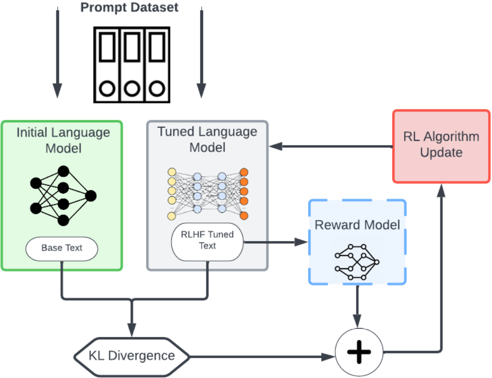



# Reward Models in RLHF

As LLMs scale, their raw outputs (optimized primarily for next-token prediction) often diverge from expected traits. To enable RL fine-tuning from human feedbacks (RLHF), reward models are introduced as trainable proxies for human preference. Once trained, it can generalize preference signals to unseen inputs, making alignment more scalable by reducing reliance on slow and costly human annotations. It also allows flexible fine-tuning toward different objectives, such as helpfulness, truthfulness, or safety.

A typical alignment pipeline consists of 3 stages: supervised fine-tuning (SFT), reward modeling, and RL. After an initial SFT based on base transformer with curated human-labeled data, a reward model is constructed to predict human preferences over model-generated responses. This model is then used to guide further optimization by encouraging outputs that maximize the predicted reward. For example, `ChatGPT` employs reward models trained on ranked annotations to guide its generation toward preferred outputs (Achiam, Adler, and Agarwal 2024); `DeepSeek` and `LLaMA 2` include explicit reward modeling components in their alignment pipelines, using pairwise preferences to train reward models that inform subsequent learning (Shao, Wang, and Zhu 2024; Touvron, Martin, and Stone 2023).

Achiam, Josh, Steven Adler, and Sandhini Agarwal. 2024. “GPT-4 Technical Report.” <https://arxiv.org/abs/2303.08774>.

Shao, Zhihong, Peiyi Wang, and Qihao Zhu. 2024. “DeepSeekMath: Pushing the Limits of Mathematical Reasoning in Open Language Models.” <https://arxiv.org/abs/2402.03300>.

Touvron, Hugo, Louis Martin, and Kevin Stone. 2023. “Llama 2: Open Foundation and Fine-Tuned Chat Models.” <https://arxiv.org/abs/2307.09288>.

