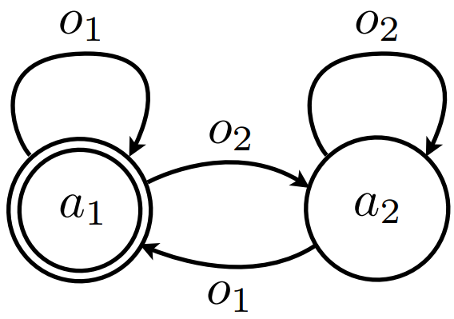



# Dec-POMDP

**Definition 1**. *A Dec-POMDP is a tuple $\langle \mathbb{I}, \mathcal{S}, \{\mathbb{A}_i\}, T, R, \{\mathbb{O}_i\}, O, \mathcal{H}, \gamma\rangle$:*

- *$\mathbb{I}$ is a finite sets of agents, $|\mathbb{I}|=n$;*

- *$\mathcal{S}$ is a set of states with designated initial state distribution $b^0$;*

- *$\mathbb{A}_i$ is a set of actions for agent $i$ with $\mathbb{A}\doteq \times_i \mathbb{A}_i$ the set of joint actions;*

- *$T$ is the state transition probability function, $T$: $\mathcal{S} \times \mathbb{A} \times \mathcal{S} \rightarrow [0, 1]$, that specifies the probability of transitioning from state $s \in \mathcal{S}$ to $s' \in \mathcal{S}$ when the actions $\boldsymbol{a} \in \mathbb{A}$ are taken by agents (i.e., $T(s, \boldsymbol{a}, s')=P(s'|s, \textbf{a})$);*

- *$R$ is the joint reward function, where $R$: $\mathcal{S} \times \mathbb{A} \rightarrow \mathbb{R}$;*

- *$\mathbb{O}_i$ is a set of observations for each agent $i$, with $\mathbb{O}\doteq\times_i \mathbb{O}_i$ the set of joint observations;*

- *$O$ is an observation probability function, $O$: $\mathbb{A} \times \mathcal{S} \times \mathbb{O}$, that specifies the probability of seeing observation $\boldsymbol{o}' \in \mathbb{O}$ given the actions $\boldsymbol{a} \in \mathbb{A}$ are taken and state $s' \in \mathcal{S}$ is observed (i.e., $O(\boldsymbol{a}, s', \boldsymbol{o}')=P(\boldsymbol{o}'|\textbf{a},s')$);*

- *$\mathcal{H}$ is the horizon (the number of steps until termination);*

- *$\gamma$ is the discount factor for the return.*

*A solution to a Dec-POMDP is a joint policy $\boldsymbol{\pi}:\mathbb{H}_i\to\mathbb{A}_i, \forall i \in \mathbb{I}$ over joint observation-action history $\boldsymbol{h}=\{\boldsymbol{a}^{0}, \boldsymbol{o}^{1}, \cdots \boldsymbol{o}^{\mathcal{H}-1}\}$, an optimal solution maximizes the expected return, $$\boldsymbol{\pi}^*=\mathop{\mathrm{argmax}}_{\boldsymbol{\pi}}\mathbb{E}\left[\textstyle\sum_{t=0}^{\mathcal{H}-1}R(\boldsymbol{h}, \boldsymbol{\pi}(\boldsymbol{h}))\middle|b^0\right].$$*

In Dec-POMDP, the Bellman recursive formulation of the history V-function is,

$$\label{eq:decpomdp-V}
\begin{aligned}
    V^{\boldsymbol{\pi}}(\boldsymbol{h}) &= \sum_{s} P(s|b^0, \boldsymbol{h})\left[R(s, \boldsymbol{\pi}(\boldsymbol{h}))+\gamma \sum_{s'}P(s'|s, \boldsymbol{\pi}(\boldsymbol{h})) \sum_{\boldsymbol{o}'}P(\boldsymbol{o}'|\boldsymbol{\pi}(\boldsymbol{h}), s') V^{\boldsymbol{\pi}}(\boldsymbol{h}') \right]\\
    &\equiv R(\boldsymbol{h}, \boldsymbol{\pi})+\gamma\sum_{\boldsymbol{o}'}P(\boldsymbol{o}'|\boldsymbol{h}, \boldsymbol{\pi}) V^{\boldsymbol{\pi}}(\boldsymbol{h}'),
\end{aligned}$$


The definition of the value function is flexible: it may be based on the value of a state, a belief state, an observation, a state history, an observation history, a single action (single-step policy), a full policy (action history), observation–action history, or combinations of these.


the Bellman recursive formulation of the **history-policy** Q-function is,

$$\label{eq:decpomdp-q}
\small
\begin{aligned}
    Q^{\boldsymbol{\pi}}(\boldsymbol{h}, \boldsymbol{\pi}) &= \sum_{s} P(s|b^0, \boldsymbol{h})\left[R(s, \boldsymbol{\pi}(\boldsymbol{h}))+\gamma\sum_{s'}P(s'|s, \boldsymbol{\pi}(\boldsymbol{h})) \sum_{\boldsymbol{o}'}P(\boldsymbol{o}'|\boldsymbol{\pi}(\boldsymbol{h}), s') Q^{\boldsymbol{\pi}}(\boldsymbol{h}', \boldsymbol{\pi}(\boldsymbol{h}')) \right]\\
    &\equiv R(\boldsymbol{h}, \boldsymbol{\pi})+\gamma\sum_{\boldsymbol{o}'}P(\boldsymbol{o}'|\boldsymbol{h}, \boldsymbol{\pi}) Q^{\boldsymbol{\pi}}(\boldsymbol{h}', \boldsymbol{\pi}) .
\end{aligned}$$

# Subclasses

#### Centralized Control

MMDP is a fully observable version of Dec-POMDP, but it does not specify decentralized control. Dec-MDP assumes that the joint observations uniquely determine the state, while agents still act with local observations. Similarly, MPOMDP does not specify whether the control is decentralized, which could have a centralized policy $\mathbb{H}\to\mathbb{A}$.

#### Independent Variables

A decentralized control model might be factorized with independent local variables, e.g., transition-independence (TI) $T(s, \boldsymbol{a}, s')=\Pi_{i=1}^{n} T(s_i, a_i, s_i')$ and reward-independence (RI) $R(s,\boldsymbol{\pi})=f_\text{mono}(\langle R(s_i, \pi_i)\rangle_{i=1}^{n})$. Network-distributed POMDP (ND-POMDP) represents the factored one with TI and block-RI, i.e., $R(s,\boldsymbol{\pi})=f_\text{mono}(\langle R(s_{i, \mathcal{N}(i)}, \pi_{i, \mathcal{N}(i)})\rangle_{i=1}^{n})$, where ${\mathcal{N}(i)}$ are the neighbors of $i$.

#### Complexity

The worst-case complexity of finite-horizon problems is: (by Amato et al., 2013)

| **Model**              |     | **Complexity**  |
|:-----------------------|:----|:----------------|
| MDP                    |     | P-complete      |
| MMDP (Cen-MMDP)        |     | P-complete      |
| Dec-MDP                |     | NEXP-complete   |
| Dec-MDP with TI no RI  |     | NP-complete     |
| Dec-MDP with RI no TI  |     | NEXP-complete   |
| Dec-MDP with TI and RI |     | P-complete      |
| POMDP                  |     | PSPACE-complete |
| MPOMDP (Cen-MPOMDP)    |     | PSPACE-complete |
| Dec-POMDP              |     | NEXP-complete   |
| ND-POMDP               |     | NEXP-complete   |

**Theorem 1**. *An MDP is P-complete in finite and infinite horizons (Papadimitriou and Tsitsiklis 1987).*

**Theorem 2**. *A finite POMDP is PSPACE-complete (Papadimitriou and Tsitsiklis 1987).*

**Theorem 3**. *The complexity of an infinite POMDP is undecidable (Madani, Hanks, and Condon 1999), leading to the undecidability of the infinite Dec-POMDP complexity.*

**Theorem 4**. *A finite $\text{Dec-POMDP}_{n\geqslant2}$ is NEXP-complete, and a finite $\text{Dec-MDP}_{n\geqslant3}$ is also NEXP-complete (Bernstein et al. 2002).*

**Fact 1**. *A Dec-MDP with TI and RI can be solved independently, resulting in P-complete.*

**Theorem 5**. *A Dec-MDP with TI and joint reward is NP-complete, a Dec-MDP with RI but no TI is NEXP-complete (Becker et al. 2004)*

**Fact 2**. *An ND-POMDP has the same worst-case complexity as a Dec-POMDP (Nair et al. 2005).*

# Planning Methods

## Policy Structure

Calculating a shared belief state in Dec-POMDP is hard, because the policy can not be recovered from the value function. The policies are normally maintained in a policy tree or FSC. Policies can be extracted by starting at the root (or initial node) and continuing to the subtree (or next node) based on observations, and can be evaluated by summing the rewards weighted by transition probability.


Policy can also be represented by other forms, like approximating functions (Sutton and Barto 2018), neural networks, diffusion models (Chi et al. 2024), etc.



<figure>
  
  <figcaption>Policy Tree (PT)</figcaption>
</figure>
<--->
<figure>
  
  <figcaption>Finite State Controller (FSC)</figcaption>
</figure>


## Optimal Approaches

#### Bottom-up

DP uses joint belief to find optimal solutions with policy pruning (Hansen, Bernstein, and Zilberstein 2004).

$$V^{t+1}(b^t) = \max_{a \in \mathcal{A}} \left\{ \sum_{s \in \mathcal{S}} b^t(s) 
\left[ R(s, a) + \sum_{o \in \mathcal{O}} \mathcal{P}(o \mid s, a) V^t(b^{t+1}) \right] \right\}.$$

**Input:** Depth-$t$ policy trees $Q_i^t$ and value vectors $V_i^t$ for each $i$

Perform exhaustive backups to get $Q_i^{t+1}$, and compute $V_i^{t+1}$ accordingly for each $i$ Find a policy tree $q_j \in Q_i^{t+1}$ that satisfies $\exists \ v_k \in \{V_i^{t+1} \setminus v_j\},b^{t+1} v_k \geq b^{t+1} v_j, \forall \ b^{t+1}$ $Q_i^{t+1} \gets \{Q_i^{t+1} \setminus q_j\}$, and $V_i^{t+1} \gets \{V_i^{t+1} \setminus v_j\}$ accordingly

**Output:** Depth-$t+1$ policy trees $Q_i^{t+1}$ and value vectors $V_i^{t+1}$ for each $i$

#### Top-down

The policy tree can also be built using heuristic search like MAA\* (Szer, Charpillet, and Zilberstein 2005).

**Initialize:** Joint policy tree root $\Pi\gets\times_i \mathbb{A}_i$  
**Input:** Depth-$t$ joint policy tree $\Pi$

Select $a^*=\mathop{\mathrm{argmax}}_{a\in \Pi}F^\mathcal{H}(b^0, a)$ (heuristic and value) Expand $a^*$ to $a^\circledast$, and $\Pi \gets \{\Pi \cup  a^\circledast\}$ $\Pi \gets \{\Pi \setminus a\}$ $\Pi \gets \{\Pi \setminus a^*\}$

**Input:** Updated joint policy set $\Pi$.

## Approximation Approaches

The algorithms below improve scalability to larger problems over optimal methods, but do not possess any bounds on solution quality.

#### MBDP

Memory-bounded dynamic programming (MBDP) techniques mitigate the scalability problem of DP (which generates and evaluates all joint policy trees before pruning) by keeping a fixed number of policy trees for each agent at each step (Seuken and Zilberstein 2007b). Several approaches have improved on MBDP by limiting (Seuken and Zilberstein 2007a) or compressing (Carlin and Zilberstein 2008) observations, replacing exhaustive backup with branch-and-bound search in the space of joint policy trees (Dibangoye, Mouaddib, and Chaib-draa 2009) as well as constraint optimization (Kumar and Zilberstein 2010) and linear programming (Wu, Zilberstein, and Chen 2010) to increase the efficiency of selecting the best trees at each step.

#### JESP

The joint equilibrium search for policies (JESP) Nair et al., 2003 uses alternating best response. Initial policies are generated for all agents, and then all but one is held fixed. The remaining agent can then calculate the best response (local optimum) to the fixed policies. The policy of this agent becomes fixed and the next agent calculates the best response. These best-response calculations to fixed other agent policies continue until no agent changes its policy.

# Complexity Classes

Assuming $c$ and $k$ are constants, $\mathcal{C}$ is a complexity class, the table shows complexity terminologies.

|                        |                                                                                                  |
|:-----------------------|:-------------------------------------------------------------------------------------------------|
| P                      | the set of problems solvable in polynomial time, e.g., $O(n^k)$                                  |
| NP                     | the set of problems solvable nondeterministically in polynomial time                             |
| EXP                    | the set of problems solvable in exponential time, e.g., $O(c^{n^k})$                             |
| NEXP                   | the set of problems solvable nondeterministically in exponential time                            |
| PSPACE                 | the set of problems solvable in polynomial space (P and NP $\subset$ PSPACE), e.g., $O(c^{n^k})$ |
| $\mathcal{C}$-hard     | a problem that all problems in $\mathcal{C}$ are reducible to within polynomial time             |
| $\mathcal{C}$-complete | a problem that is contained in $\mathcal{C}$ and $\mathcal{C}$-hard                              |

<!-- footnotes converted to hints above -->

Amato, Christopher, Girish Chowdhary, Alborz Geramifard, N. Kemal Üre, and Mykel J. Kochenderfer. 2013. “Decentralized Control of Partially Observable Markov Decision Processes.” In *52nd IEEE Conference on Decision and Control*, 2398–2405. <https://doi.org/10.1109/CDC.2013.6760239>.

Becker, Raphen, Shlomo Zilberstein, Victor Lesser, and Claudia V. Goldman. 2004. “Solving Transition Independent Decentralized Markov Decision Processes.” *Journal of Artificial Intelligence Research* 22: 423–55.

Bernstein, Daniel S., Robert Givan, Neil Immerman, and Shlomo Zilberstein. 2002. “The Complexity of Decentralized Control of Markov Decision Processes.” *Mathematics of Operations Research* 27 (4): 819–40.

Carlin, A., and S. Zilberstein. 2008. “Value-Based Observation Compression for DEC-POMDPs.” In *Proceedings of the Seventh International Conference on Autonomous Agents and Multiagent Systems*.

Chi, Cheng, Zhenjia Xu, Siyuan Feng, Eric Cousineau, Yilun Du, Benjamin Burchfiel, Russ Tedrake, and Shuran Song. 2024. “Diffusion Policy: Visuomotor Policy Learning via Action Diffusion.” *The International Journal of Robotics Research*.

Dibangoye, J. S., A.-I. Mouaddib, and B. Chaib-draa. 2009. “Point-Based Incremental Pruning Heuristic for Solving Finite-Horizon DEC-POMDPs.” In *Proceedings of the Eighth International Conference on Autonomous Agents and Multiagent Systems*.

Hansen, Eric A, Daniel S Bernstein, and Shlomo Zilberstein. 2004. “Dynamic Programming for Partially Observable Stochastic Games.” In *AAAI*, 4:709–15.

Kumar, A., and S. Zilberstein. 2010. “Point-Based Backup for Decentralized POMDPs: Complexity and New Algorithms.” In *Proceedings of the Ninth International Conference on Autonomous Agents and Multiagent Systems*, 1315–22.

Madani, Omid, Steve Hanks, and Anne Condon. 1999. “On the Undecidability of Probabilistic Planning and Infinite-Horizon Partially Observable Markov Decision Problems.” In, 541–48. AAAI ’99/IAAI ’99. Orlando, Florida, USA: American Association for Artificial Intelligence.

Nair, Ranjit, Milind Tambe, Makoto Yokoo, David V. Pynadath, and Stacy Marsella. 2005. “Networked Distributed POMDPs: A Synthesis of Distributed Constraint Optimization and POMDPs.” In *Proceedings of the 20th National Conference on Artificial Intelligence (AAAI-05)*, 133–39. AAAI Press.

Nair, Ranjit, Milind Tambe, Makoto Yokoo, David Pynadath, and Stacy Marsella. 2003. “Taming Decentralized POMDPs: Towards Efficient Policy Computation for Multiagent Settings.” In *IJCAI*, 3:705–11.

Papadimitriou, Christos H., and John N. Tsitsiklis. 1987. “The Complexity of Markov Decision Processes.” *Mathematics of Operations Research* 12 (3): 441–50. <https://doi.org/10.1287/moor.12.3.441>.

Seuken, Sven, and Shlomo Zilberstein. 2007a. “Improved Memory-Bounded Dynamic Programming for Decentralized POMDPs,” 344–51.

———. 2007b. “Memory-Bounded Dynamic Programming for DECPOMDPs.” *Proceedings of the 20th International Joint Conference on Artificial Intelligence (IJCAI)*, 2009–15.

Sutton, Richard S., and Andrew G. Barto. 2018. *Reinforcement Learning: An Introduction*. 2nd ed. MIT Press.

Szer, Daniel, François Charpillet, and Shlomo Zilberstein. 2005. “MAA\*: A Heuristic Search Algorithm for Solving Decentralized POMDPs.” In *Proceedings of the 21st Conference on Uncertainty in Artificial Intelligence (UAI)*, 576–90. AUAI Press.

Wu, F., S. Zilberstein, and X. Chen. 2010. “Point-Based Policy Generation for Decentralized POMDPs.” In *Proceedings of the Ninth International Conference on Autonomous Agents and Multiagent Systems*, 1307–14.

